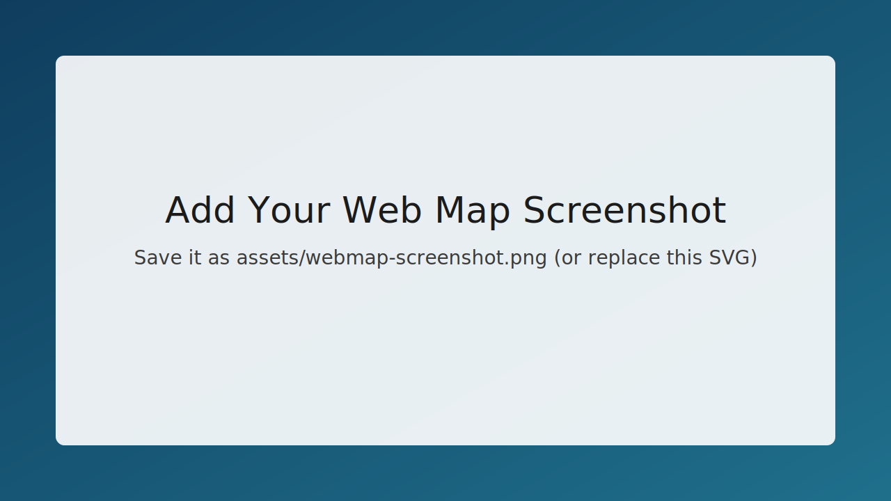

# Visualising-Electoral-Votes-Difference-across-US-States-using-Arcgis-Map-SDK

ArcGIS Map SDK for JavaScript project that visualizes US state-level electoral differences through an interactive map experience, with opacity-based rendering and interactive exploration of vote-gap patterns.

## ArcGIS Web Map Visualization

This project contains an ArcGIS Maps SDK for JavaScript visualization demo with two views:

- Election gap visualization (Obama vs McCain 2008 precinct-level data)
- Custom 3D scene with a tintable tile layer (OpenTopoMap)

## Tech Stack

- ArcGIS Maps SDK for JavaScript 5.0 (CDN)
- ArcGIS Web Components and Calcite Components
- HTML5, CSS3, Vanilla JavaScript (ES Modules)

## Project Structure

- `Index.html`: Main page markup
- `styles.css`: Visual styling
- `app.js`: Interactive map/scene logic
- `assets/webmap-screenshot.svg`: Screenshot placeholder image

## Screenshot



## Run Locally

```bash
python -m http.server 8000
```

Then open `http://localhost:8000/`.
